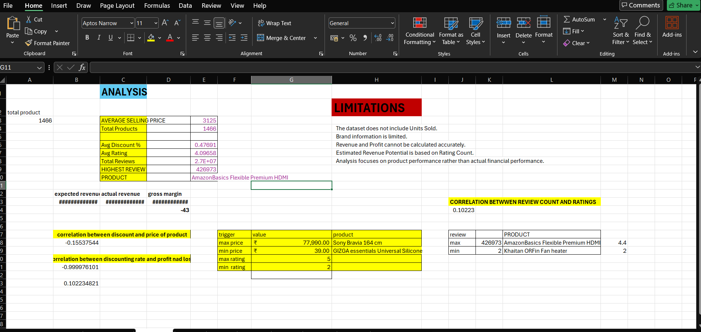
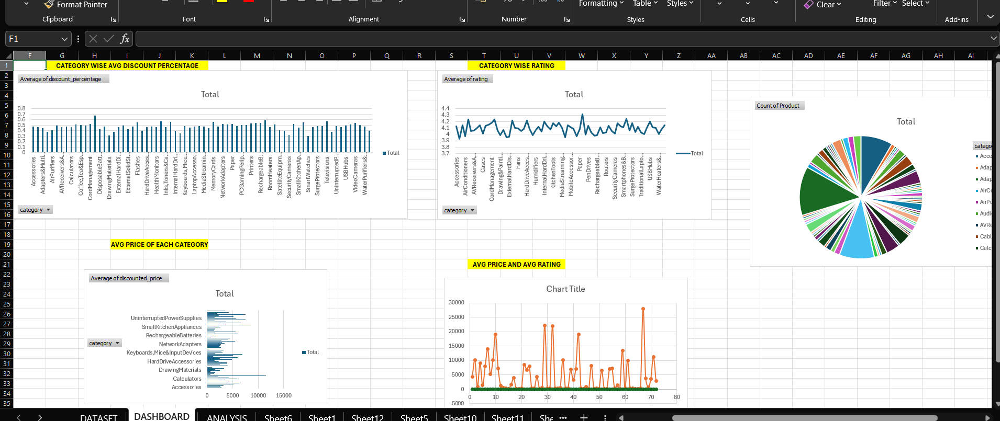
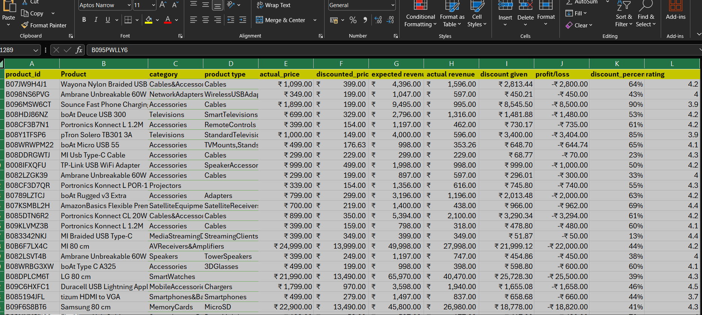

# Amazon Product Analysis Dashboard

## 📌 Overview
This project analyzes Amazon product data to uncover insights into pricing strategies, discounts, customer ratings, and revenue performance.  
The dashboard highlights **expected vs. actual revenue**, **profit/loss tracking**, and **customer engagement metrics**.

---

## 📊 Dataset Description
The dataset includes:
- **Product details**: Product ID, name, category, type  
- **Pricing**: Actual price, discounted price, discount percentage  
- **Revenue metrics**: Expected revenue, actual revenue, profit/loss  
- **Customer insights**: Ratings, rating count, user engagement  

Data was self-prepared for analysis and visualization purposes.

---

## 🔑 Key Insights
- Discounts drive higher sales volume but can reduce profit margins.  
- Some categories are misclassified (e.g., cables under televisions) — cleaning improves accuracy.  
- Outliers (80–90% discounts) skew averages and should be flagged separately.  
- Ratings correlate strongly with user engagement and product success.  

---

## 📈 Dashboard Features
- Revenue vs. discount visualization  
- Profit/loss tracking across categories  
- Rating distribution charts  
- Top-selling vs. least profitable products  

---

## ⚙️ How to Reproduce
1. Clone this repository:
   ```bash
   git clone https://github.com/kshitiz1414/amazon-product-analysis-dashboard.git
## 📷 Screenshots
  
  

