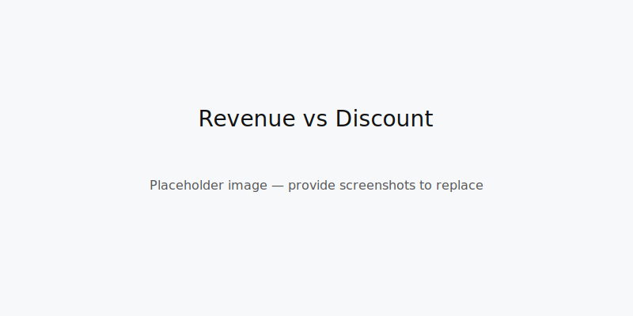
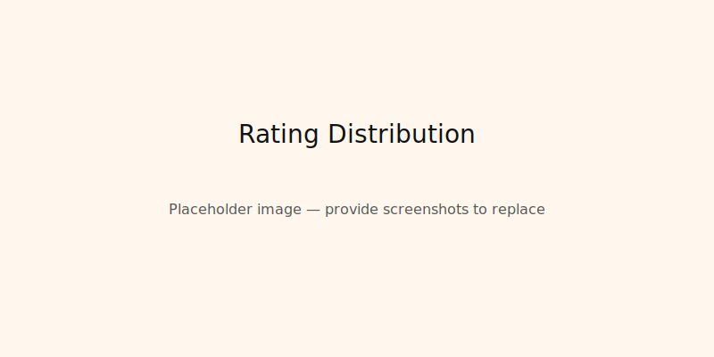
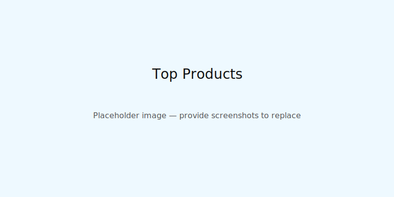

# Amazon Product Analysis Dashboard

## 📌 Overview
This project analyzes Amazon product data to uncover insights into pricing strategies, discounts, customer ratings, and revenue performance. The dashboard highlights **expected vs. actual revenue**, **profit/loss tracking**, and **customer engagement metrics**.

---

## 📊 Dataset
The repository contains a prepared dataset used for analysis:

- `Amazon_Analysis_Ready_Final I MADE.xlsx` — cleaned and aggregated product data used to build the dashboard and charts.

If you need the raw export or other formats (CSV/Parquet), tell me and I can add them.

---

## 🔑 Key Insights
- Discounts drive higher sales volume but can reduce profit margins.
- Some categories are misclassified (e.g., cables under televisions) — cleaning improves accuracy.
- Outliers (80–90% discounts) skew averages and should be flagged separately.
- Ratings correlate strongly with user engagement and product success.

---

## 📈 Dashboard Features
- Revenue vs. discount visualization
- Profit / loss tracking across categories
- Rating distribution charts
- Top-selling vs. least profitable products

---

## ⚙️ Reproduce the analysis
1. Clone this repository:

```bash
git clone https://github.com/kshitiz1414/amazon-product-analysis-dashboard.git
cd amazon-product-analysis-dashboard
```

2. Requirements

- Python 3.8+ (if running analysis scripts)
- Jupyter or JupyterLab for notebooks (optional)
- Install dependencies (if a requirements file is added):

```bash
pip install -r requirements.txt
```

3. Data

The main prepared dataset is `Amazon_Analysis_Ready_Final I MADE.xlsx` — open it in Excel, or export sheets as CSV for programmatic use. If you want, I can add a `data/` directory with CSV copies.

---

## 📷 Screenshots







---

## 🧑‍💻 Author
- GitHub: [@kshitiz1414](https://github.com/kshitiz1414)

If you'd like a full name, email, or website listed here, reply with the details and I'll update it.

---

## 🤝 Contributing
Contributions are welcome. Open an issue or submit a pull request with improvements, fixes, or additional visualizations.

---


